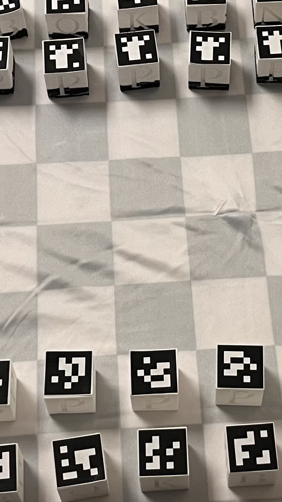
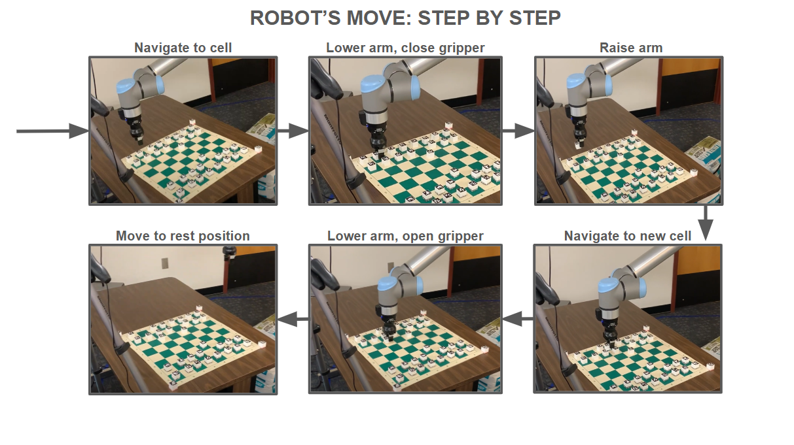
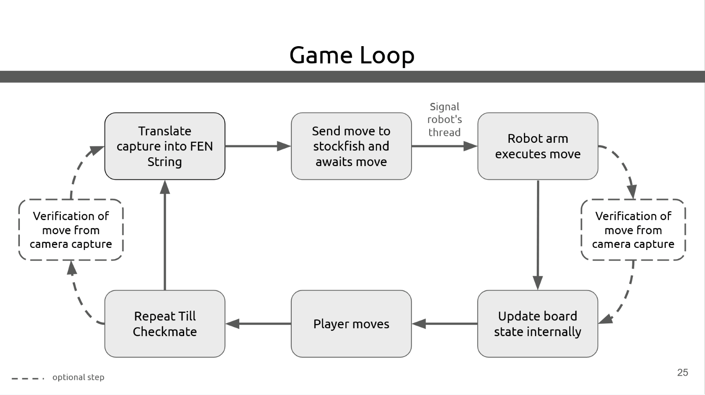

# Robotic Chess Player
[](http://wiki.ros.org/noetic)
[](https://www.python.org/)
[](https://releases.ubuntu.com/20.04/)
[](LICENSE)

## Table of Contents
- [Overview](#overview)
- [Features](#features)
- [System Components](#system-components)
- [Demo](#demo)
- [Prerequisites](#prerequisites)
- [How does the system work?](#how-does-the-system-work)
  - [Board Detection](#board-detection)
  - [Pieces](#pieces)
  - [Chess Engine](#chess-engine)
  - [Robotic Arm](#robotic-arm)
- [Game Loop](#game-loop)
- [Repository Structure](#repository-structure)
- [Quick Start](#quick-start)
- [Running the Robot](#running-the-robot)
  - [With Real Hardware](#with-real-hardware)
  - [With Simulator](#with-simulator)
- [Development](#development)
- [Documentation](#documentation)
- [License](#license)

## Overview

Traditional chess engines exist in the digital realm, but integrating artificial intelligence with physical gameplay presents unique challenges. Our project addresses the gap between virtual chess engines and real-world play by creating an autonomous robotic system capable of physically manipulating chess pieces on a standard chessboard while playing at various skill levels against human opponents.

This repository contains a complete ROS workspace for a robotic chess player using a UR10e robot arm with a Robotiq gripper.

## Features
- Autonomous chess gameplay using industrial robotic arm
- Computer vision with AprilTag detection for board state recognition
- Adaptive Stockfish chess engine with configurable difficulty
- Safe, precise movement patterns for chess piece manipulation
- Compatible with standard chess pieces and board
- Robust vision system that works in variable lighting conditions

## System Components
| Component | Description |
|-----------|-------------|
| **Hardware** | UR10e robotic arm, Hand-e gripper, RGB camera, standard chessboard |
| **Software** | Ubuntu 20.04, ROS Noetic, Python 3.8+, OpenCV, Stockfish |

## Demo

<div align="center">
  <a href="https://youtube.com/shorts/Rwi2C9OqR34?si=AcufbHRkkVXkCidu">
    
  </a>
  <p><i>Click the image to watch the robotic chess player in action</i></p>
</div>

## Prerequisites
- Ubuntu 20.04
- ROS Noetic (full install)
- Python 3.8 or higher
- At least 16GB RAM
- Camera with USB connection
- UR10e robot arm and Robotiq Hand-e gripper (for hardware deployment)

## How does the system work?
### Board Detection
The vision system uses Perturb-detect-clustering mechanism to detect April Tags even in poor lighting conditions. It will apply randomized affine transformations along with color perturbations to eventually detect the tags.

### Pieces
Each piece is a perfect cube, with an april tag on the top for detection and a letter(e.g. P for pawn, Q for queen) etched into each of the four sides. Black pieces(top of image) are denoted by the lower half of the piece shaded black.
<div align="center">
  
</div>

### Chess Engine
We use the Stockfish chess engine to analyze positions and determine optimal moves. The difficulty can be calibrated to match players of any skill level.

### Robotic Arm
A UR10e robotic arm with a Hand-e gripper physically moves chess pieces on the board. The system uses inverse kinematics and sophisticated path planning to ensure precise, safe movements.
<div align="center">
  
</div>

## Game Loop
The game follows a standard loop: the robot makes a move, the vision system detects the new state, the player responds with their move on the physical board, the vision system detects the new state, and the cycle continues until checkmate.
<div align="center">
  
</div>

## Repository Structure

This is a complete Catkin workspace that includes:
- Our main package (`sd02_joseph-hoane_1`)
- All necessary drivers:
  - `robotiq` - Robotiq gripper drivers
  - `universal_robot` - Universal Robots description and configuration
  - `ur_msgs` - Universal Robots message definitions
  - `Universal_Robots_ROS_Driver` - Main UR driver
- `isu_rel` - Additionaly for testing purposes

## Quick Start

```bash
# 1. Clone the repository
git clone https://github.com/autrin/robotic-chess-player.git
cd robotic-chess-player

# 2. Build the workspace
catkin_make

# 3. Source the setup file
source devel/setup.bash
```

## Running the Robot

### With Real Hardware

1. Launch the UR robot driver
   ```bash
   roslaunch ur_robot_driver ur10e_griper_bringup.launch
   ```

2. Access external control on the teach pendant

3. Launch the Robotiq gripper driver (if not already initialized)
   ```bash
   roslaunch robotiq_2f_gripper_control robotiq_action_server.launch
   ```

4. Run the main program
   ```bash
   rosrun sd02_joseph-hoane_1 main test
   # OR for production mode
   rosrun sd02_joseph-hoane_1 main
   ```

### With Simulator

1. Start ROS core
   ```bash
   roscore
   ```

2. Launch the simulator
   ```bash
   rosrun sd02_joseph-hoane_1 simulator.py
   ```

3. Run the main program in test mode
   ```bash
   rosrun sd02_joseph-hoane_1 main.py test
   ```


## Development

### Install `jh1` as a Python Library

For development, you can install the Python package in development mode:

```bash
pip install -e ./src
```

## Documentation

For more information, see the [Final Report](Document/SD02-Final-Report.pdf)

## License

This project is licensed under the Apache License 2.0 - see the [LICENSE](LICENSE) file for details.

Team SD02 (Spring 2025) at Iowa State University requires attribution for use of this codebase.
See the [NOTICE](NOTICE) file for details.